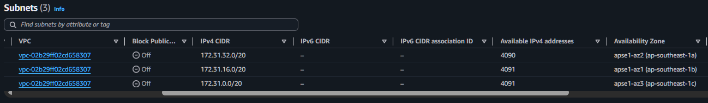
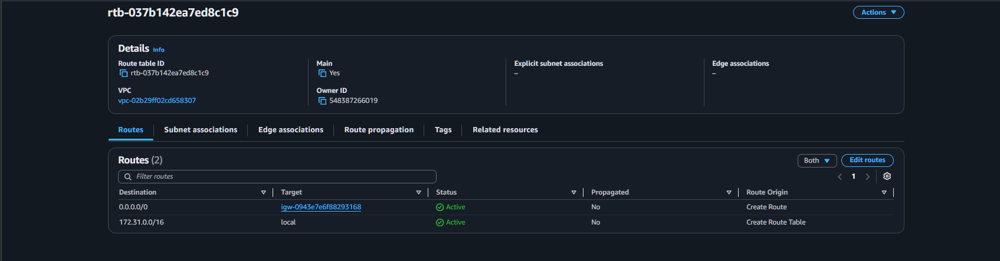
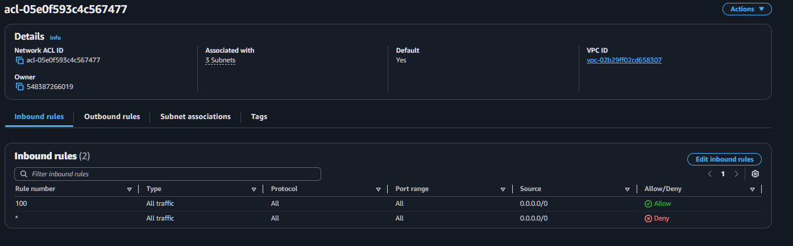
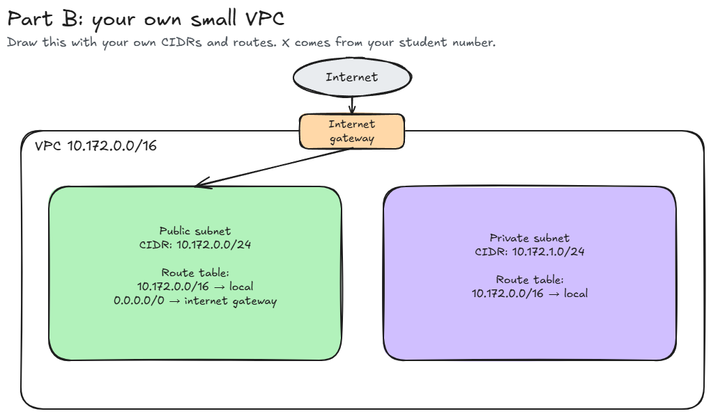

# Assignment 2 Submission

## About me

- GitHub username: Motea47
- Section: IV-DCSAD
- IAM user name that I signed in with: `dcsad-g07`
- X: 172

---

## Part A. Explore

### A1. The VPC

Default VPC IPv4 CIDR:

`172.31.0.0/16`

Number of addresses in that CIDR:

65,536

### A2. The subnets

| Availability Zone | IPv4 CIDR |
| --- | --- |
| `ap-southeast-1a` | `172.31.32.0/20` |
| `ap-southeast-1b` | `172.31.16.0/20`  |
| `ap-southeast-1c` | `172.31.0.0/20` |

Screenshot 1. Save it as `screenshot-1-subnets.png` in your folder. The image line below shows it.

### A3. Available addresses

Available IPv4 addresses in each subnet:

`ap-southeast-1a`: 4,090
`ap-southeast-1b`: 4,091
`ap-southeast-1c`: 4,091

Why is the number lower than 4,096?

A `/20` subnet contains 4,096 IPv4 addresses, but AWS reserves 5 addresses in every subnet. Thus, an empty `/20` subnet has 4,091 usable addresses.

What uses the missing address in the subnet with the lowest number?

The subnet in `ap-southeast-1a` has 4,090 available addresses, which is one fewer than the other subnets. One address is being used by a network interface attached to an AWS resource in that subnet.

### A4. The route table

| Destination | Target |
| --- | --- |
| `0.0.0.0/0` | `igw-0943e7e6f88293168`  |
| `172.31.0.0/16`  | `local` |

Screenshot 2. Save it as `screenshot-2-routes.png` in your folder. The image line below shows it.

### A5. Public or private

Are the default subnets public or private? Which route proves it?

The default subnets are public. The route `0.0.0.0/0` points to the internet gateway, which gives the subnets a route to the internet.

### A6. The internet gateway

State of the internet gateway:

The state of the internet gateway is Attached.

What happens to the default subnets if the gateway is detached?

If the internet gateway is detached, the default subnets lose their path to the internet because the `0.0.0.0/0` route would no longer have a working internet gateway target. Resources inside the VPC can still communicate with each other through the local route.
### A7. NAT gateways

Number of NAT gateways:

The number of NAT gateways is 0.

Can a server in a new private subnet download updates? Why?

No. There is currently no NAT gateway in the VPC. A server in a private subnet would need a route to a NAT gateway to reach the internet for updates without being directly exposed to incoming internet traffic.

### A8. The network ACL

| Rule number | Source | Allow or Deny |
| --- | --- | --- |
| `100`  | `0.0.0.0/0` | Allow |
| `*` | `0.0.0.0/0` | Deny |

How is a network ACL different from a security group?

A network ACL applies to an entire subnet and can contain both allow and deny rules. It is stateless, so traffic in each direction must be allowed separately. A security group applies to individual resources, uses allow rules only, and is stateful.

Screenshot 3. Save it as `screenshot-3-network-acl.png` in your folder. The image line below shows it.

### A9. The default security group

Inbound rule (type and source):

All traffic, from the `default` security group itself (`sg-0c5b6d4081cf0a534`).

Which resources can send traffic to an instance that uses it?

Only resources that are also associated with the `default` security group can send traffic to the instance through this inbound rule.

---

## Part B. Prepare

### B1. Plan two subnets

- Public subnet CIDR: `10.172.0.0/24`
- Private subnet CIDR: `10.172.1.0/24`

### B2. Route tables

Route table of the public subnet:

| Destination | Target |
| --- | --- |
| `10.172.0.0/16` | local |
| `0.0.0.0/0` | internet gateway |

Route table of the private subnet:

| Destination | Target |
| --- | --- |
| `10.172.0.0/16` | local |

### B3. My VPC diagram

Tool used (Excalidraw, draw.io, Lucidchart, or paper):

Tool used is Excalidraw.

Save your diagram as `vpc-diagram.png` in your folder. The image line below shows it.

### B4. Predict a change

Can you still open the web page from your laptop? Why?

Yes. The local route for `172.31.0.0/16` still exists, so instances inside the same default VPC can still communicate with each other.

Can the instance still reach another instance in the VPC? Why?

Yes. The local route for `10.172.0.0/16` still exists, so instances inside the same VPC can still communicate with each other.

### B5. Place a database

Which subnet gets the database? Why?

The database should be placed in the private subnet, `10.172.1.0/24`, because the private subnet has no route to the internet gateway. This prevents the database from being directly reachable from the internet.

### B6. My question about VPCs

What is your question, and what made you think of it?

My question is how can two VPCs communicate securely with each other? The current activity shows how subnets inside the same VPC communicate using the local route, but it does not explain how resources in different VPCs communicate.
